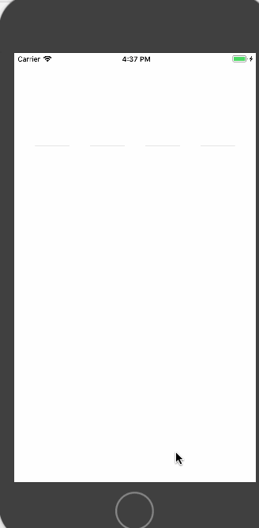

# KPIdCodeView
类似摩拜验证码，和一些大众的验证码 有回调 很方便

 KPIdCodeView *idView =[[KPIdCodeView alloc] initWithFrame:CGRectMake(0, 100, self.view.bounds.size.width, 60) codeCount:4];
    [self.view addSubview:idView];
    idView.idCodeCallBack = ^(NSString *code) {
        NSLog(@"*************%@",code);
    };
    
    

